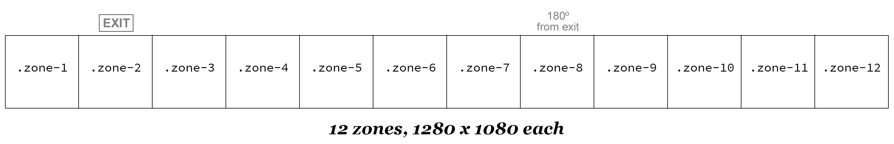

# Visualization Studio HTML Framework

A lightwweight HTML/CSS framework for displaying diverse content in 360º wraparound mode in the Visualization Studio at the D.H. Hill Jr. Library.

Layouts are created based on grid system that divides the full display into equal-width zones. The default is a 12-zone grid. 8- and 10-zone grids are also available.


## Quick start

1. Clone or download this repository to your computer
2. Open one of the HTML template files in a web browser to preview the layout (content will scale to fit your display)


## Usage overview

### CSS

`.vizstudio.css` contains all the CSS required for the default 12-zone grid. This should be linked within the `<head>` of the HTML document:

```html
<link rel="stylesheet" type="text/css" href="css/vizstudio.css"/>
```

To use the 8- or 10-zone grids, also include the files `vizstudio_grid8.css` or `vizstudio_grid10.css` respectively:


```html
<link rel="stylesheet" type="text/css" href="css/vizstudio.css"/>
<link rel="stylesheet" type="text/css" href="css/vizstudio_grid8.css"/>
```

See [Using alternate grids](#using-alternate-grids) below for details.


### HTML templates

This repository includes several HTML templates to help you get started. If one of these layouts is suiable for your project, you can simply make a copy of it and begin adding content. Otherwise, you can modify the template to create a different layout. See [HTML document structure](#html-document-structure) below for details.

The file `template.html` uses the full 12-zone layout, and includes examples of optional elements. This file also includes extensive inline documentation.

Other HTML files are included as examples of different layouts:
* `template_4zones` - A layout with 4 equal-width zones using the default grid.
* `template_6zones` - A layout with 6 equal-width zones using the default grid.
* `template_full` - A layout with one zone spanning the entire display.
* `template_longshort` - A layout with alternating long and short zones using the default grid.
* `template_grid8` - A basic layout using an 8-zone grid.
* `template_grid10` - A basic layout using a 10-zone grid.


### Adding content

Each template includes a number of `<div>` elements with class `zone`. Your content will go inside of these. To automatically scale images, video and other elements to fit the height of the display, use a `<div>` with class `wrapper` to enclose the content, as demonsteated in `template.html`:

```html
...
<div class="zone zone-1">  
  <div class="wrapper">
    <!-- CONTENT GOES HERE -->
  </div>
</div>
...
```

#### Examples

##### Image:

```html
...
<div class="zone zone-1">  
  <div class="wrapper">
    
  </div>
</div>
...
```

##### Video:

```html
...
<div class="zone zone-1">  
  <div class="wrapper">
    <video src="media/video/goldfish.mp4"></video>
  </div>
</div>
...
```

##### Target element for Javascript (e.g. for data visualizations):

> Note that you will also need to include the associated javascript file (see below).

```html
...
<div class="zone zone-1">  
  <div class="wrapper">
    <div id="my-data-viz"></div>
  </div>
</div>
...
```


### Javascript

All the templates include links to Javascript files that are useful for testing and development:

1. `transform_scale.js`
   Including this file will scale the entire layout to fit the width of a smaller display (e.g. on a laptop), which is essential for previewing layouts in development. It only applies to displays smaller than 10,000 pixels wide, so it will have no affect when displayed in the Visualization Studio.

2. `template_demo.js`
   Including this file will allow you to preview a layout without adding any content. If you open one of the included HTML files in a browser, you'll see the classes applied to each zone element, along with its dimensions. **Once you start adding content to the zones in your document, you should disable this by removing this line from your HTML**:

   ```html
   <script type="text/javascript" src="js/template_demo.js"></script>
   
   ```

#### Adding custom Javascript

To add custom javascript to your HTML file, add it just BEFORE `transform_scale.js`:

```html
...
  <script type="text/javascript" src="js/my-custom-javascript.js"></script>

  <!-- this Javascript will scale the display down to fit your browser window, very useful for development -->
  <script type="text/javascript" src="js/transform_scale.js"></script>

</body>
</html>
```


## HTML document structure

The basic document structure includes a container element (a block-level element with class `vizstudio`) that wraps several `<div>` elements with class `zone`, which specify areas of the display into which content can be added.


### `vizstudio`

A container element with the class `vizstudio` is used to wrap all displayable content. This can be either a `<div>` or `<main>`. This element will cover the full width and height of the display, beginning and ending at the "wraparound point".

```html
...
<main class="vizstudio">
...
```

### Zones

The container (`.vizstudio`) is divided into areas of equal width, and each of these areas is represented by a `<div>` element with the class `zone`. The default CSS uses a 12-zone grid, with each zone being 1280 pixels wide. Other grid configurations are available - see [Using alternate grids](#using-alternate-grids) below for details.


#### Zone position

Each zone is absolutely positioned on the display. The position is indicated using the classes `zone-1` through `zone-12`.


The basic HTML for the 12-zone layout looks like this:

```html
...
<main class="vizstudio">
  <div class="zone zone-1"></div>
  <div class="zone zone-2"></div>
  <div class="zone zone-3"></div>
  <div class="zone zone-4"></div>
  <div class="zone zone-5"></div>
  <div class="zone zone-6"></div>
  <div class="zone zone-7"></div>
  <div class="zone zone-8"></div>
  <div class="zone zone-9"></div>
  <div class="zone zone-10"></div>
  <div class="zone zone-11"></div>
  <div class="zone zone-12"></div>
</main>
...

```

#### Spanning zones

To extend the width of a zone to span zones to its right, use the classes `span-2` through `span-12` as required. Remember that the appropriate position class must still be included.

The image below shows a few examples of combining position and span classes to create different layouts. Many other combinations are possible.


Using the default 12-zone grid, you can combine position and span classes to achieve a layout with 1, 2, 3, 4, 6 or 12 equal-width zones. Here's's the HTML for a layout with 4 equal-width zones (i.e. each occupying one quareter of the space):

```html
...
<main class="vizstudio">
  <div class="zone zone-1 span-3"></div>
  <div class="zone zone-4 span-3"></div>
  <div class="zone zone-7 span-3"></div>
  <div class="zone zone-10 span-3"></div>
</main>
...

```

This HTML provides a layout using alternating long and short zones:

```html
...
<main class="vizstudio">
  <div class="zone zone-1 span-2"></div>
  <div class="zone zone-3"></div>
  <div class="zone zone-4 span-2"></div>
  <div  class="zone zone-6"></div>
  <div class="zone zone-7 span-2"></div>
  <div class="zone zone-9"></div>
  <div class="zone zone-10 span-2"></div>
  <div class="zone zone-12"></div>
</main>
...

```

If you try to span a zone beyond the right edge of the display (the wraparound point), the maximum available width will be applied. For example this:

```html
<div class="zone zone-11 span-3"></div>

```

will display the same as this:

```html
<div class="zone zone-11 span-2"></div>

```


#### Displaying full-width content

The class `full` can be used as a shorthand for `zone-1 span-12`, to create a single zone that spans across the entire display.

```html
...
<div class="zone full"></div>
...
```

Use this layout to display 360º panoramic images or video, or other content that extends around the entire space.


## Using alternate grids

### 8-zone grid

The 8-zone grid divides the display into 8 zones, each 1920 pixels wide.


Using the 8-zone grid, you can combine position and span classes to achieve a grid of 1, 2, 4, or 8 equal-width zones. Other layouts are possible using span classes.


### 10-zone grid

The 10-zone grid divides the display into 10 zones, each 1536 pixels wide. 


Note that, using the 10-zone grid, you can combine position and span classes to achieve a grid of 1, 5 or 10 equal-width zones.

### Usage

To use the 8-zone or 10-zone grid, add the class `grid-8` or `grid-10` to the containing element, e.g.:

```html
...
<main class="vizstudio grid-8">
...
```

* For the 8-zone grid, use only position classes through `zone-8` and span classes through `span-8`
* For the 10-zone grid, use only position classes through `zone-10` and span classes through `span-10`
* Position and span classes outside these ranges will be ignored
* The `full` class can be used the same way it is in the 12-zone grid


## Optional elements

### `zone-wrapper`

A `<div class="zone-wrapper">` element can be used as a second wrapper around `zone` elements within `vizstudio`, without affecting the display. This can be useful for animation and other scripted behavior targeting the entire layout.

```html
...
<main class="vizstudio">
  <div class="zone-wrapper">
    <div class="zone zone-1 span-3"></div>
    <div class="zone zone-4 span-3"></div>
    <div class="zone zone-7 span-3"></div>
    <div class="zone zone-10 span-3"></div>
  </div>
</main>
...

```

### Audio (or other non-visible content)

The CSS class `.hidden` can be used anywhere in the document, even outside the containing `.vizstudio` element, to include non-displaying content. This is especially useful for including audio:

```html
...
</main>

<div id="audio" class="hidden">
  <audio src="meida/audio/jams.mp3">
</div>

```

*Note that hidden audio must be started using Javascript.*


## Using custom CSS

The CSS in this framework is intended to be design-agnostic. If you need to display HTML content and want to apply your styles to it, you need to use custom CSS.

To add your own CSS, link it in the `<head>` BEFORE all the vizstudio css files (to ensure that the custom CSS doesn't override anything it shouldn't):

```html
<!-- Your custom CSS goes after the framework CSS -->
<link rel="stylesheet" type="text/css" href="css/my-custom-css.css"/>

<link rel="stylesheet" type="text/css" href="css/vizstudio.css"/>
<link rel="stylesheet" type="text/css" href="css/vizstudio_grid8.css"/>
```

